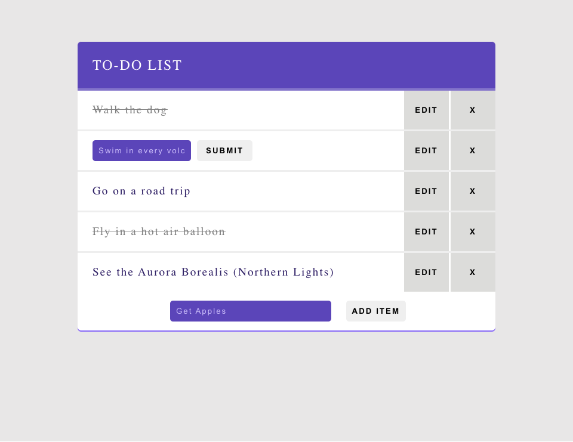

# To-Do List App

To-Do List App is a react app for organizing a list of errands and other tasks that one needs or intends to accomplish. The user can add tasks to the list, mark items on the list as completed, as well as edit and delete tasks.

## Links

- [Live Demo](https://to-do-list-app-client.netlify.app/)

## Screenshots

### Home Page:

## Technology

### Built with:

- React, including useState and useEffect

  - Created with [create-react-app](https://github.com/facebook/create-react-app)

- JavaScript, HTML and CSS
